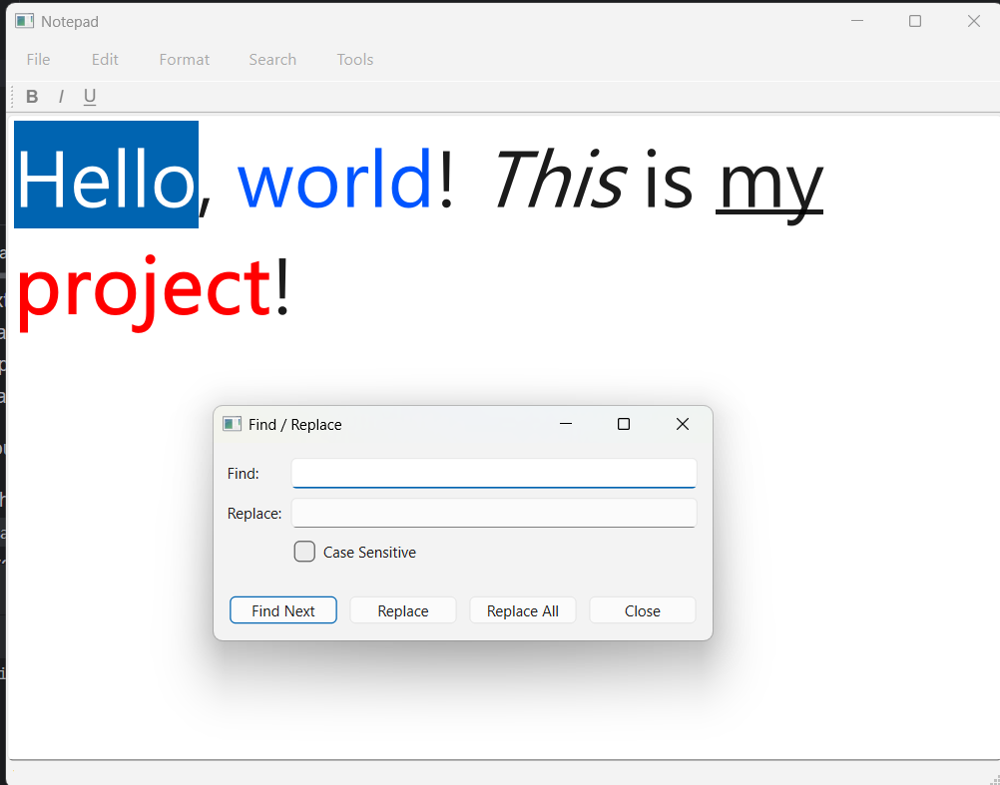

Notepad
====================================

## Developer Tools

* [CLion](https://www.jetbrains.com/clion/download)
* [Git SCM](https://git-scm.com/downloads)

## Libraries

* [Qt 6](https://www.qt.io)

---

## Features

### 1. Exception Handling

Integrated the exception hierarchy from Practice #8 into the application:

* Created `notepad_exception.h` with `notepad_exception`, `file_not_found_exception`, `file_read_exception`, and `file_write_exception` (as in Practice #8).
* Wrapped `open_file()` and `save_file()` in `try / catch` blocks; display errors with `QMessageBox::critical`.

### 2. Spell Checker

Added a spell checker using the provided `data/words.txt` word list (one word per line). The list is `words_alpha.txt` from [dwyl/english-words](https://github.com/dwyl/english-words), released into the public domain under [The Unlicense](https://github.com/dwyl/english-words/blob/master/LICENSE.md) (370105 lowercase a-z entries).

* Loaded the word list from `data/words.txt` at startup (read into a `std::set<std::string>` or similar).
* Real-time inline highlighting: misspelled words are underlined in red as you type, using a `QSyntaxHighlighter` subclass with `QTextCharFormat::SpellCheckUnderline`.
* Right-click context menu: right-clicking a misspelled word shows a `QMenu` with up to 5 spelling suggestions; clicking a suggestion replaces the word in the editor.
* Added a `Tools` > `Check Spelling...` menu item that re-runs the highlight pass over the whole document.
* A word is misspelled if, after lowercasing and stripping non-alphabetic characters, it is not found in the word list.

### 3. Cursor line / column indicator

Added current cursor line and column to the existing status bar using `blockNumber` and `columnNumber`

### 4. Font dialog

Added a font dialog where the user is able to choose the font.

* Added an action to Format submenu
* Connected the action with opening of `QFontDialog`
* When the font from `QFontDialog` is chosen, the font is applied to the selection or whole document.

### 5. Color picker

Added a color picker dialog where the user is able to choose the color.

* Added an action to Format submenu
* Connected the action with opening of `QColorDialog`
* When the color from `QColorDialog` is chosen, the color is applied to the selection

### 6. Print

Added a print dialog where the user is able to print the file

* Added QPrint module to the included libraries
* Added an action to File submenu
* Connected an action with opening of QPrintDialog
* The configuration saved in `QPrintDialog` is loaded into `QPrint` object
* `QTextEdit::print` prints the file using the configuration saved in `QPrint` object

###  7. Recent files

Added Recent files submenu to the File submenu where the user can see the recently opened documents

* Added `update_recent_files` member function that updates the `recent_files` vector
* `update_recent_files` clears the `recent_files_menu` and readds all the elements listed in `recent_files` vector
* After updating the vector list, `update_recent_files` updates the settings
* `update_recent_files` updates when the main_window is created and every time the `open_file` member function is called